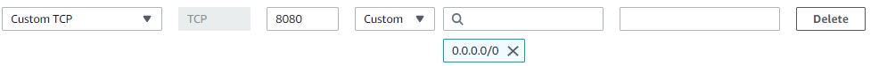

#### Prueba 3 - CI/CD

Dockerizar un nginx con el index.html default.
Elaborar un pipeline que ante cada cambio realizado sobre el index.html buildee la nueva imagen y la actualize en la plataforma elegida. (docker-compose, swarm, kuberenetes, etc.)
Para la creacion del CI/CD se puede utilizar cualquier plataforma (CircleCI, Gitlab, Github, Bitbucket.)

## Solución

Lo que se busca hacer en esta parte del ejercicio, es al pushear cambios a nuestro repositorio de github, este mismo lo detecte y a partir de eso, buildea un docker compose, que llama a un dockerfile para crear una imagen de docker, y esta es subida a un repositorio en docker-hub. La idea es poder de una manera fácil aplicar los cambios y que se vean reflejados en una imagen de docker que cualquiera pueda hacerle un pull

Se decidió usar github actions, y requiere que creemos una carpeta llamada **.github/workflows**, y dentro de esta un **archivo .yml**, que tiene las instrucciones necesarias para hacer lo mencionado arriba. Colocamos la contraseña y el usuario de dockerhub como un **secreto en github**, para que desde el .yml pueda loguearse y pushear la latest image construida a partir del docker compose.

Podremos ver la página por defecto de nginx

Importante: En el caso de utilizar **AWS**, hay que crear una inbound rule para el security group que use la instancia que usemos para habilitar el puerto que estemos usando para la aplicación, en este caso el 8080




Para que comience el pipeline:

```
git add
git commit -m "msj"
git push
```

Una vez subida a Docker-hub:

```docker pull nachobergan/devops-craftech.io:latest```

Finalmente podremos utilizar el docker-compose, estando en el directorio del docker-compose:

 ```docker-compose up --build```

 En el docker-compose solo mapeamos los puertos, asi que en vez del anterior commando tambien podriamos ejecutar:

```docker run -p 8080:80 imageID```
