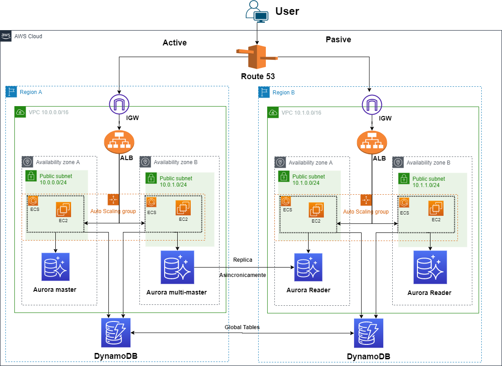

#### Prueba 1 - Diagrama de Red

Produzca un diagrama de red (puede utilizar lucidchart) de una aplicación web en GCP o AWS y escriba una descripción de texto de 1/2 a 1 página de sus elecciones y arquitectura.

El diseño debe soportar:

- Cargas variables
- Contar con HA (alta disponibilidad)
- Frontend en Js
- Backend con una base de datos relacional y una no relacional
- La aplicación backend consume 2 microservicios externos

 
El diagrama debe hacer un mejor uso de las soluciones distribuidas.

## Solucion:

Para esta solucion vamos a utilizar la nube de AWS.

Como se trata de un ejercicio de contenedores, primero hay que decidir que servicio usar para este requerimiento. Podemos usar: AWS EC2, AWS ECS (Nodos EC2 o Fargate) o AWS Elastic Beanstalk, o EKS. Nuestra decision va a variar segun el contexto en el que nos encontremos:
- AWS EC2: Bajo Precio, poca eficiencia
- Elastic Beanstalk: Poca complejidad (Alto nivel de abstraccion)
- EKS: Requerimientos multi nube 
- ECS: Modo EC2/Fargate

Se utilizara **AWS Elastic Container Service (ECS): Modo Fargate** para los contenedores. 

Nuestro diseño necesita soportar **cargas variables**, para esto se utilizaran Auto Scaling Groups, que permitiran que nuestras instancias EC2 dentro del cluster ECS usen el concepto de elasticidad, cuando la demanda aumente, se lanzaran nuevas instancias, y en caso de que la demanda decrezca, se terminaran instancias. En el caso de las instancias de Aurora, se escalan automaticamente. Y en el caso de DynamoDB hay que setear el Auto Scaling "ON" 

Tambien nos pide **HA (High Availability)**, con lo cual, replicaremos nuestro diseño a otra zona de disponibilidad, y utilizaremos un elastic load balancer para distribuir la carga entre Clusters ECS de diferentes AZs. Si aun queremos más HA, podriamos implementar la solucion planteada a otra region, y utilizar Route 53 para hacer un Active-Pasive Failover, es decir que los recursos solo estaran disponibles si la region completa falla. En el caso de DynamoDB, hay que utilizar tablas globales. Para la base de datos relacional, se eligio Aurora sobre RDS, porque RDS no permite hacer un failover automatico entre regiones, más bien es manual. En el caso de Aurora, promueve una Read Replica automaticamente a una Master replica en el caso de un fallo de region.

Los contenedores soportan **javascript** y permiten interactuar con **Aurora y DynamoDB, bases de datos relacional y no relacional respectivamente**. Por ultimo tambien desde un contentedor se pueden hacer **requests a APIs externas, para el uso de microservicios externos**
